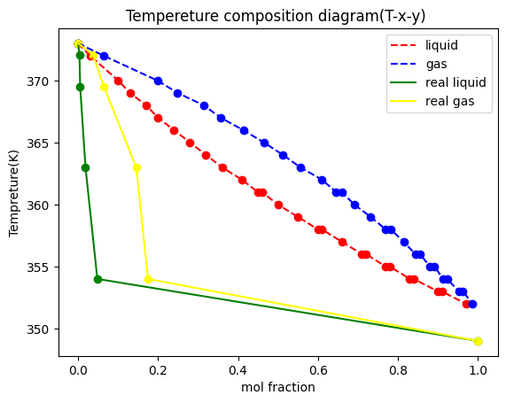
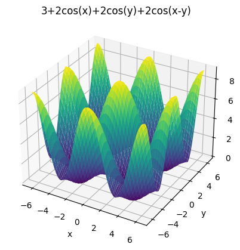
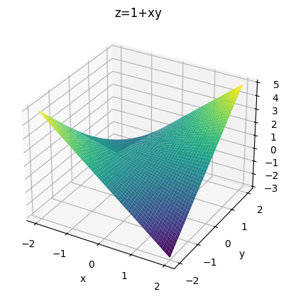

- matplotlib

-- 그래프를 그리는 라이브러리.\
[matplotlib](https://matplotlib.org)

Quick start guide를 참고..

---



---


```{python}
#| echo: False
#| output: True
#| warning: False

import matplotlib.pyplot as plt
import numpy as np

th=np.linspace(0,2*np.pi,100)
r=np.linspace(0,1,100)

def ff(c,a):
  return r**4-2*c**(2)*r**(2)*np.cos(2*th)+c**4-a**4


for c in range(3):
  for a in range(3):
    plt.polar(th,r,ff(c,a),label=f"(a,b)=({a},{c})")

plt.title('Cassini oval in polar axes')
plt.show()

```
---





---


- 사용법


---

-- 예시

```{python}
#| warning: False

import matplotlib.pyplot as plt
import numpy as np

x=np.linspace(0,np.pi,50)
y=np.sin(x)
z=np.cos(x)

plt.figure()

plt.plot(x,y,label='sine line',color='red')
plt.scatter(x,z,label='cosine dot',color='blue')

plt.hlines(y=1/2**0.5,xmin=0,xmax=np.pi/4,color='green')
plt.axhline(y=0,color='black',linewidth=5)
plt.vlines(x=np.pi/4,ymin=0,ymax=1/2**0.5,color='green')

tick=np.linspace(0,np.pi,13)
plt.xticks(
    tick,
    ['0',
    'π/12', 'π/6', 'π/4', 'π/3', '5π/12',
    'π/2', '7π/12', '2π/3', '3π/4', '5π/6', '11π/12',
    'π']
)

plt.fill_between(x,y,where=((np.pi/2<=x) & (x<=2*np.pi/3)),color='skyblue',alpha=0.5)


plt.xlabel('x')
plt.ylabel('y')
plt.title('Example')

plt.annotate('intersection',xy=(np.pi/4,1/2**0.5),xytext=(np.pi/6,-0.5),arrowprops=dict(arrowstyle='->', color='purple'))

plt.grid()
plt.legend()
plt.show()

```

---

- 1. 라이브러리 선언과 함수 정의

```{python}
#| echo: True

import matplotlib.pyplot as plt
import numpy as np

x=np.linspace(0,np.pi,50)
y=np.sin(x)
z=np.cos(x)

```

---

- 2. '도화지'를 준비하고 점/선 그리기

```{python}
#| echo: False
#| warning: False
#| output: True

import matplotlib.pyplot as plt
import numpy as np

x=np.linspace(0,np.pi,50)
y=np.sin(x)
z=np.cos(x)

plt.figure(figsize=(6.4,4.8))

plt.plot(x,y,label='sine line',color='red')
plt.scatter(x,z,label='cosine dot',color='blue')
```

```python

plt.figure()

plt.plot(x,y,label='sine line',color='red')
plt.scatter(x,z,label='cosine dot',color='blue')
```


---

- 3. 보조선그리기

```{python}
#| echo: False
#| output: True

import matplotlib.pyplot as plt
import numpy as np

x=np.linspace(0,np.pi,50)
y=np.sin(x)
z=np.cos(x)

plt.figure(figsize=(6.4,4.8))

plt.plot(x,y,label='sine line',color='red')
plt.scatter(x,z,label='cosine dot',color='blue')


plt.hlines(y=1/2**0.5,xmin=0,xmax=np.pi/4,color='green')
plt.axhline(y=0,color='black',linewidth=5)
plt.vlines(x=np.pi/4,ymin=0,ymax=1/2**0.5,color='green')

```

```python
plt.hlines(y=1/2**0.5,xmin=0,xmax=np.pi/4,color='green')
plt.axhline(y=0,color='black',linewidth=5)
plt.vlines(x=np.pi/4,ymin=0,ymax=1/2**0.5,color='green')

```

---

- 4. 눈금 표시하고 그래프 밑면적 채우기.

```{python}
#| echo: False
#| output: True
#| warning: False

import matplotlib.pyplot as plt
import numpy as np

x=np.linspace(0,np.pi,50)
y=np.sin(x)
z=np.cos(x)

plt.figure(figsize=(6.4,4.8))

plt.plot(x,y,label='sine line',color='red')
plt.scatter(x,z,label='cosine dot',color='blue')


plt.hlines(y=1/2**0.5,xmin=0,xmax=np.pi/4,color='green')
plt.axhline(y=0,color='black',linewidth=5)
plt.vlines(x=np.pi/4,ymin=0,ymax=1/2**0.5,color='green')

tick=np.linspace(0,np.pi,13)
plt.xticks(tick,
    ['0','π/12', 'π/6', 'π/4', 'π/3', '5π/12',
    'π/2', '7π/12', '2π/3', '3π/4', '5π/6', '11π/12','π'])

plt.fill_between(x,y,where=((np.pi/2<=x) & (x<=2*np.pi/3)),color='skyblue',alpha=0.5)

```

```python
tick=np.linspace(0,np.pi,13)
plt.xticks(tick,['0','π/12', 'π/6', 'π/4', 'π/3', '5π/12',
    'π/2', '7π/12', '2π/3', '3π/4', '5π/6', '11π/12','π'])

plt.fill_between(x,y,where=((np.pi/2<=x) & (x<=2*np.pi/3)),color='skyblue',alpha=0.5)
```

---

- 5. 축 이름과 그래프 제목 정하기.

```{python}
#| echo: False
#| output: True
#| warning: False

import matplotlib.pyplot as plt
import numpy as np

x=np.linspace(0,np.pi,50)
y=np.sin(x)
z=np.cos(x)

plt.figure(figsize=(6.4,4.8))

plt.plot(x,y,label='sine line',color='red')
plt.scatter(x,z,label='cosine dot',color='blue')


plt.hlines(y=1/2**0.5,xmin=0,xmax=np.pi/4,color='green')
plt.axhline(y=0,color='black',linewidth=5)
plt.vlines(x=np.pi/4,ymin=0,ymax=1/2**0.5,color='green')

tick=np.linspace(0,np.pi,13)
plt.xticks(
    tick,
    ['0',
    'π/12', 'π/6', 'π/4', 'π/3', '5π/12',
    'π/2', '7π/12', '2π/3', '3π/4', '5π/6', '11π/12',
    'π']
)

plt.fill_between(x,y,where=((np.pi/2<=x) & (x<=2*np.pi/3)),color='skyblue',alpha=0.5)
plt.xlabel('x')
plt.ylabel('y')
plt.title('Example')
```


```python
plt.xlabel('x')
plt.ylabel('y')
plt.title('Example')
```

---

- 6. 강조하기

```{python}
#| echo: False
#| output: True
#| warning: False

import matplotlib.pyplot as plt
import numpy as np

x=np.linspace(0,np.pi,50)
y=np.sin(x)
z=np.cos(x)

plt.figure(figsize=(6.4,4.8))

plt.plot(x,y,label='sine line',color='red')
plt.scatter(x,z,label='cosine dot',color='blue')


plt.hlines(y=1/2**0.5,xmin=0,xmax=np.pi/4,color='green')
plt.axhline(y=0,color='black',linewidth=5)
plt.vlines(x=np.pi/4,ymin=0,ymax=1/2**0.5,color='green')

tick=np.linspace(0,np.pi,13)
plt.xticks(
    tick,
    ['0',
    'π/12', 'π/6', 'π/4', 'π/3', '5π/12',
    'π/2', '7π/12', '2π/3', '3π/4', '5π/6', '11π/12',
    'π']
)

plt.fill_between(x,y,where=((np.pi/2<=x) & (x<=2*np.pi/3)),color='skyblue',alpha=0.5)
plt.xlabel('x')
plt.ylabel('y')
plt.title('Example')


plt.annotate('intersection',xy=(np.pi/4,1/2**0.5),xytext=(np.pi/6,-0.5),arrowprops=dict(arrowstyle='->', color='purple'))

```

```python
plt.annotate('intersection',xy=(np.pi/4,1/2**0.5),xytext=(np.pi/6,-0.5),arrowprops=dict(arrowstyle='->', color='purple'))
```

---

- 7. 마무리

```{python}
#| echo: False
#| output: True
#| warning: False

import matplotlib.pyplot as plt
import numpy as np

x=np.linspace(0,np.pi,50)
y=np.sin(x)
z=np.cos(x)

plt.figure(figsize=(6.4,4.8))

plt.plot(x,y,label='sine line',color='red')
plt.scatter(x,z,label='cosine dot',color='blue')


plt.hlines(y=1/2**0.5,xmin=0,xmax=np.pi/4,color='green')
plt.axhline(y=0,color='black',linewidth=5)
plt.vlines(x=np.pi/4,ymin=0,ymax=1/2**0.5,color='green')

tick=np.linspace(0,np.pi,13)
plt.xticks(
    tick,
    ['0',
    'π/12', 'π/6', 'π/4', 'π/3', '5π/12',
    'π/2', '7π/12', '2π/3', '3π/4', '5π/6', '11π/12',
    'π']
)

plt.fill_between(x,y,where=((np.pi/2<=x) & (x<=2*np.pi/3)),color='skyblue',alpha=0.5)
plt.xlabel('x')
plt.ylabel('y')
plt.title('Example')


plt.annotate('intersection',xy=(np.pi/4,1/2**0.5),xytext=(np.pi/6,-0.5),arrowprops=dict(arrowstyle='->', color='purple'))

plt.grid()
plt.legend()
plt.show()
```


```python
plt.grid()
plt.legend()
plt.show()
```

---

- 7-1. 파일로 저장하기

```python
plt.show()
...

plt.savefig('figure.png')
plt.savefig(r"C:\User\Users\Desktop\figure.png")
```
---

